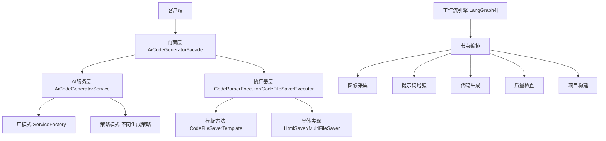

# Kircevy AI 代码生成平台

<div align="center">


**🚀 下一代企业级智能代码生成引擎**

融合多模态AI能力与先进软件工程实践，构建从需求理解到代码交付的全自动化DevOps流水线

[快速开始](#快速开始) • [功能特性](#功能特性) • [架构设计](#架构设计) • [API文档](#api文档)

</div>

## 📋 目录

- [项目介绍](#项目介绍)
- [功能特性](#功能特性)
- [技术栈](#技术栈)
- [架构设计](#架构设计)
- [快速开始](#快速开始)
- [配置说明](#配置说明)
- [API文档](#api文档)
- [部署指南](#部署指南)
- [监控运维](#监控运维)
- [贡献指南](#贡献指南)

## 🎯 项目介绍

Kircevy AI 是一个基于 LangChain4j 框架构建的企业级智能代码生成平台，支持多种代码生成模式（HTML、多文件项目、Vue项目），实现从自然语言需求到生产级应用的全流程自动化转换。

### 核心优势

- 🤖 **多模态AI集成**：集成DeepSeek推理模型、阿里云通义千问等多个AI模型
- 🏗️ **企业级架构**：基于设计模式的高可扩展架构，支持高并发场景
- 🔄 **智能工作流**：基于LangGraph4j的复杂AI工作流编排
- 📊 **全链路监控**：Prometheus + Grafana 可观测性体系
- 🚀 **一键部署**：自动化项目构建与部署，支持静态资源服务

## ✨ 功能特性

### 🎨 代码生成能力
- **HTML页面生成**：单页面应用快速生成
- **多文件项目**：完整项目结构自动创建
- **Vue项目生成**：现代化前端项目一键生成
- **智能路由识别**：AI自动识别最适合的生成类型

### 🔧 工程化特性
- **流式对话**：实时代码生成反馈，支持SSE
- **多轮对话**：基于Redis的上下文记忆
- **权限控制**：基于AOP的方法级权限拦截
- **限流保护**：分布式限流防止接口滥用
- **缓存优化**：Redis + Caffeine 二级缓存

### 🚀 部署运维
- **自动化部署**：从代码生成到在线访问的完整流程
- **截图预览**：Selenium自动生成应用预览图
- **静态服务**：类Nginx的静态资源服务
- **监控告警**：全方位的性能监控与告警

## 🛠️ 技术栈

### 后端技术
- **框架**: Spring Boot 3.5.4, Spring AOP
- **AI框架**: LangChain4j 1.18.0, LangGraph4j 1.6.0
- **数据库**: MySQL 8.0, MyBatis-Flex
- **缓存**: Redis 6.0, Caffeine
- **监控**: Prometheus, Micrometer
- **其他**: Hutool, Lombok, Knife4j

### AI模型
- **主模型**: DeepSeek Chat (代码生成)
- **推理模型**: DeepSeek Reasoner (复杂推理)
- **路由模型**: 阿里云通义千问 (智能路由)
- **图像生成**: 阿里云万相 2.0

### 基础设施
- **对象存储**: 腾讯云 COS
- **容器化**: Docker, Docker Compose
- **反向代理**: Nginx (可选)
- **CI/CD**: GitHub Actions

## 🏗️ 架构设计

### 系统架构图



### 核心设计模式

- **门面模式**: `AiCodeGeneratorFacade` 统一对外接口
- **工厂模式**: `AiCodeGeneratorServiceFactory` 服务实例创建
- **策略模式**: 不同代码生成类型的策略实现
- **模板方法**: `CodeFileSaverTemplate` 标准化保存流程
- **执行器模式**: 统一的解析和保存执行逻辑

## 🚀 快速开始

### 环境要求

- Java 21+
- Maven 3.8+
- MySQL 8.0+
- Redis 6.0+
- Node.js 16+ (用于Vue项目构建)

### 1. 克隆项目

```bash
git clone https://github.com/your-username/kircevy-ai-backend.git
cd kircevy-ai-backend
```

### 2. 数据库初始化

```bash
# 创建数据库
mysql -u root -p
CREATE DATABASE kircevy_ai CHARACTER SET utf8mb4 COLLATE utf8mb4_unicode_ci;

# 导入表结构
mysql -u root -p kircevy_ai < sql/create_table.sql
```

### 3. 配置文件

复制配置模板并修改：

```bash
cp src/main/resources/application-local.yml.example src/main/resources/application-local.yml
```

### 4. 启动应用

```bash
# 开发环境启动
mvn spring-boot:run -Dspring-boot.run.profiles=local

# 或者打包后启动
mvn clean package -DskipTests
java -jar target/kircevy-ai-backend-0.0.1-SNAPSHOT.jar
```

### 5. 访问应用

- 应用地址: http://localhost:8123
- API文档: http://localhost:8123/api/doc.html
- 监控端点: http://localhost:8123/api/actuator/prometheus

## ⚙️ 配置说明

### 核心配置项

```yaml
# AI模型配置
langchain4j:
  open-ai:
    chat-model:
      base-url: https://api.deepseek.com
      api-key: ${DEEPSEEK_API_KEY}
      model-name: deepseek-v4-flash
      max-tokens: 8192

# 对象存储配置
cos:
  client:
    host: ${COS_HOST}
    secretId: ${COS_SECRET_ID}
    secretKey: ${COS_SECRET_KEY}
    region: ${COS_REGION}
    bucket: ${COS_BUCKET}

# 阿里云DashScope配置
dashscope:
  api-key: ${DASHSCOPE_API_KEY}
  image-model: wanx2.0-t2i-turbo
```

### 环境变量

创建 `.env` 文件：

```bash
# AI模型API密钥
DEEPSEEK_API_KEY=your_deepseek_api_key
DASHSCOPE_API_KEY=your_dashscope_api_key

# 数据库配置
DB_HOST=localhost
DB_PORT=3306
DB_NAME=kircevy_ai
DB_USERNAME=root
DB_PASSWORD=your_password

# Redis配置
REDIS_HOST=localhost
REDIS_PORT=6379
REDIS_PASSWORD=

# 对象存储配置
COS_HOST=your_cos_host
COS_SECRET_ID=your_secret_id
COS_SECRET_KEY=your_secret_key
COS_REGION=your_region
COS_BUCKET=your_bucket
```

## 📚 API文档

### 应用管理

#### 创建应用
```http
POST /api/app/add
Content-Type: application/json

{
  "initPrompt": "创建一个简单的计算器应用"
}
```

#### 生成代码 (流式)
```http
GET /api/app/chat/gen/code?appId=1&message=添加更多功能
Accept: text/event-stream
```

#### 部署应用
```http
POST /api/app/deploy
Content-Type: application/json

{
  "appId": 1
}
```

### 对话历史

#### 获取对话历史
```http
GET /api/chatHistory/app/1?pageSize=10
```

### 静态资源访问

#### 访问部署的应用
```http
GET /api/static/{deployKey}/
```

更多API详情请查看 [Knife4j文档](http://localhost:8123/api/doc.html)

## 🐳 部署指南

### Docker 部署

1. **构建镜像**

```bash
# 构建应用镜像
docker build -t kircevy-ai-backend:latest .
```

2. **Docker Compose 部署**

```yaml
version: '3.8'
services:
  app:
    image: kircevy-ai-backend:latest
    ports:
      - "8123:8123"
    environment:
      - SPRING_PROFILES_ACTIVE=prod
      - DB_HOST=mysql
      - REDIS_HOST=redis
    depends_on:
      - mysql
      - redis
    volumes:
      - ./tmp:/app/tmp

  mysql:
    image: mysql:8.0
    environment:
      MYSQL_ROOT_PASSWORD: password
      MYSQL_DATABASE: kircevy_ai
    volumes:
      - mysql_data:/var/lib/mysql
      - ./sql:/docker-entrypoint-initdb.d

  redis:
    image: redis:6.0-alpine
    volumes:
      - redis_data:/data

  prometheus:
    image: prom/prometheus:latest
    ports:
      - "9090:9090"
    volumes:
      - ./prometheus.yml:/etc/prometheus/prometheus.yml

volumes:
  mysql_data:
  redis_data:
```

3. **启动服务**

```bash
docker-compose up -d
```

### 生产环境部署

1. **系统要求**
   - CPU: 4核心以上
   - 内存: 8GB以上
   - 存储: 100GB以上
   - 网络: 带宽10Mbps以上

2. **性能调优**

```bash
# JVM参数优化
export JAVA_OPTS="-Xms4g -Xmx8g -XX:+UseG1GC -XX:MaxGCPauseMillis=200"

# 启动应用
java $JAVA_OPTS -jar kircevy-ai-backend.jar
```

## 📊 监控运维

### Prometheus 监控指标

- `ai_model_request_total`: AI模型请求总数
- `ai_model_response_duration_seconds`: AI模型响应时间
- `ai_model_tokens_total`: Token消耗统计
- `ai_model_errors_total`: AI模型错误统计

### Grafana 仪表板

导入预配置的Grafana仪表板：

```bash
# 导入仪表板配置
curl -X POST \
  http://grafana:3000/api/dashboards/db \
  -H 'Content-Type: application/json' \
  -d @grafana/ai_model_grafana_config.json
```

### 日志管理

应用使用 Logback 进行日志管理：

```xml
<!-- logback-spring.xml -->
<configuration>
    <appender name="STDOUT" class="ch.qos.logback.core.ConsoleAppender">
        <encoder>
            <pattern>%d{yyyy-MM-dd HH:mm:ss} [%thread] %-5level %logger{36} - %msg%n</pattern>
        </encoder>
    </appender>
    
    <appender name="FILE" class="ch.qos.logback.core.rolling.RollingFileAppender">
        <file>logs/kircevy-ai.log</file>
        <rollingPolicy class="ch.qos.logback.core.rolling.TimeBasedRollingPolicy">
            <fileNamePattern>logs/kircevy-ai.%d{yyyy-MM-dd}.log</fileNamePattern>
            <maxHistory>30</maxHistory>
        </rollingPolicy>
        <encoder>
            <pattern>%d{yyyy-MM-dd HH:mm:ss} [%thread] %-5level %logger{36} - %msg%n</pattern>
        </encoder>
    </appender>
    
    <root level="INFO">
        <appender-ref ref="STDOUT"/>
        <appender-ref ref="FILE"/>
    </root>
</configuration>
```

## 🤝 贡献指南

### 开发规范

1. **代码风格**
   - 使用 Google Java Style Guide
   - 所有公共方法必须有 Javadoc 注释
   - 单元测试覆盖率不低于 80%

2. **提交规范**
   ```
   feat: 新功能
   fix: 修复bug
   docs: 文档更新
   style: 代码格式调整
   refactor: 代码重构
   test: 测试相关
   chore: 构建过程或辅助工具的变动
   ```

3. **分支管理**
   - `main`: 主分支，用于生产环境
   - `develop`: 开发分支
   - `feature/*`: 功能分支
   - `hotfix/*`: 热修复分支

### 提交流程

1. Fork 项目
2. 创建功能分支: `git checkout -b feature/amazing-feature`
3. 提交更改: `git commit -m 'feat: add amazing feature'`
4. 推送分支: `git push origin feature/amazing-feature`
5. 创建 Pull Request

## 📄 许可证

本项目采用 MIT 许可证 - 查看 [LICENSE](LICENSE) 文件了解详情。

## 🙏 致谢

- [LangChain4j](https://github.com/langchain4j/langchain4j) - 优秀的Java AI框架
- [Spring Boot](https://spring.io/projects/spring-boot) - 强大的Java应用框架
- [DeepSeek](https://www.deepseek.com/) - 提供强大的AI模型支持

## 📞 联系我们

- 项目地址: https://github.com/your-username/kircevy-ai-backend
- 问题反馈: https://github.com/your-username/kircevy-ai-backend/issues
- 邮箱: your-email@example.com

---

<div align="center">

**如果这个项目对你有帮助，请给个 ⭐️ Star 支持一下！**

Made with ❤️ by [Kircvey](https://gitee.com/jky_3477_0)

</div>
